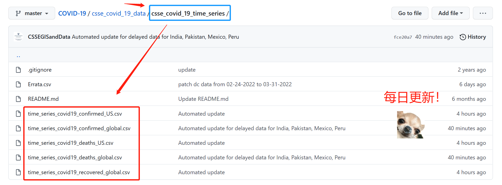
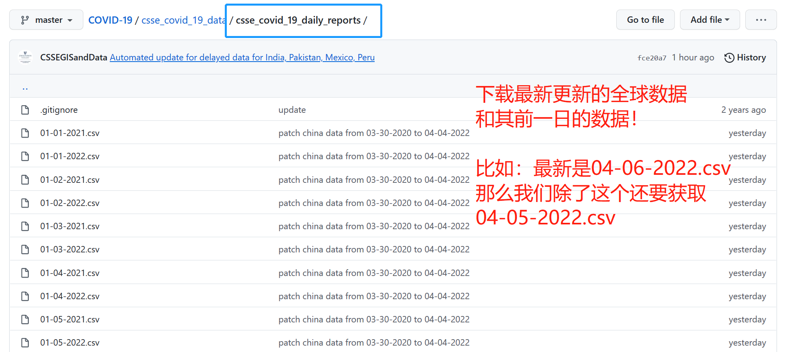
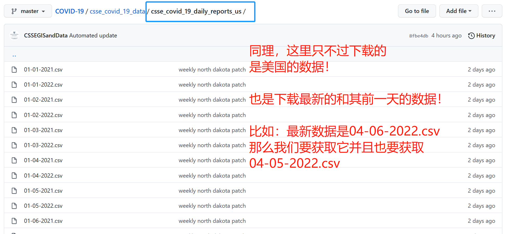

# 第一阶段 数据获取&清洗

## 课程视频

```diff
- 需要翻墙才可下载数据和观看油管视频哦！
- 在线看HTML显示不全，请下载到本地操作哦！
- 记得解锁代码再去run哦！
```

```diff
+ 点击下方的图片跳转至讲解视频！
```

👇👇👇点击👇👇👇

<div align=center>

</div>

<div align=center>
<a href='https://youtu.be/wylE0sLhvUA'> 

</div>


## 数据获取

<div align=center>

</div>

链接：https://github.com/CSSEGISandData/COVID-19/tree/master/csse_covid_19_data

<div align=center>

</div>

我们所需要的数据包含不限于：

### 时间序列数据



### 每日数据（全球）



### 每日数据（美国）




## 数据介绍

下面来对各类数据的基本信息做一梳理，包括：

- 字段含义
- 注意点

### 时间序列数据（介绍）

- 传送：https://github.com/CSSEGISandData/COVID-19/blob/master/csse_covid_19_data/csse_covid_19_time_series/README.md
- 注意：这些都是时间序列数据，包含全球（美国除外）和美国的确诊（confirmed）和死亡（deaths）还有全球的恢复（recovered）时间序列数据。
- 字段：使用`ts_data.info(verbose=2)`查看。

### 每日数据【全球】（介绍）

- 传送：https://github.com/CSSEGISandData/COVID-19/tree/master/csse_covid_19_data#daily-reports-csse_covid_19_daily_reports
- 注意：这些不是时间序列数据，是【全球】每日横截面数据，可以看到里面有很多数据，我们只需要提取最新的数据和其前一天的数据，对时序数据做信息补充。
- 字段：使用`daily_data_global.info(verbose=2)`查看。

### 每日数据【美国】（介绍）

- 传送：https://github.com/CSSEGISandData/COVID-19/tree/master/csse_covid_19_data#usa-daily-state-reports-csse_covid_19_daily_reports_us
- 注意：这些不是时间序列数据，是【美国】每日横截面数据，可以看到里面有很多数据，我们只需要提取最新的数据和其前一天的数据，对时序数据做信息补充。
- 字段：使用`daily_data_us.info(verbose=2)`查看。


## 数据清洗

<div align=center>

</div>

接下来，我们将进行数据清洗（data cleaning）。

这一阶段非常考验数据分析师的【data manipulation】能力！

要点：

- 从global数据中提取中国的数据、从US数据中提取美国的数据（注意缺失值和未知值的处理）
- 注意用`pd.to_datetime()`进行时间转换
- 计算每日新增数据
- 根据行政区确诊数降序排列

