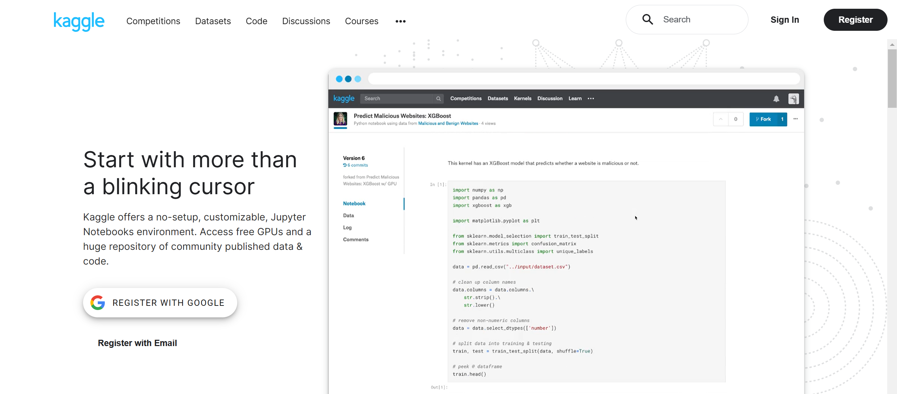
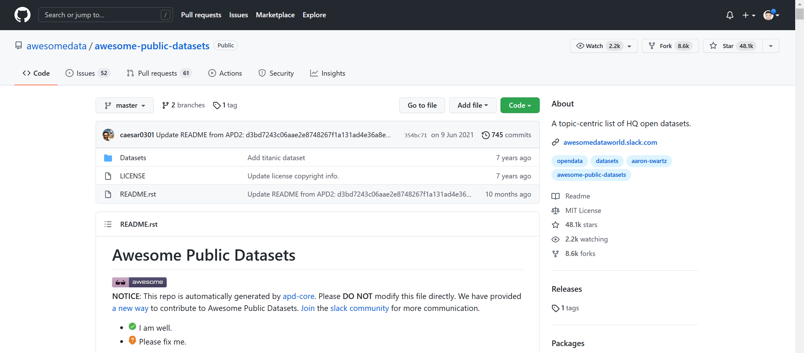
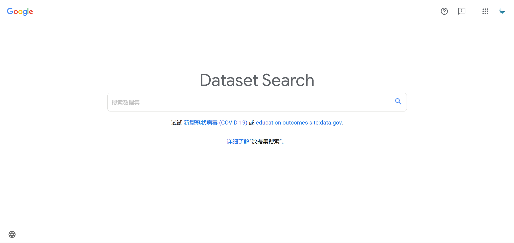
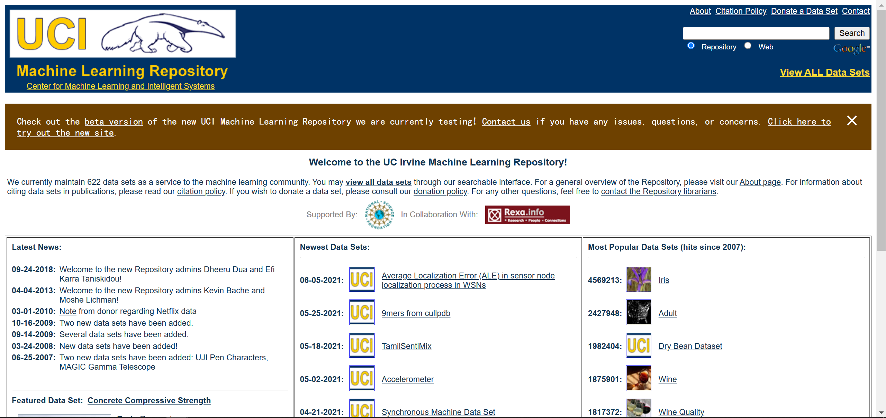
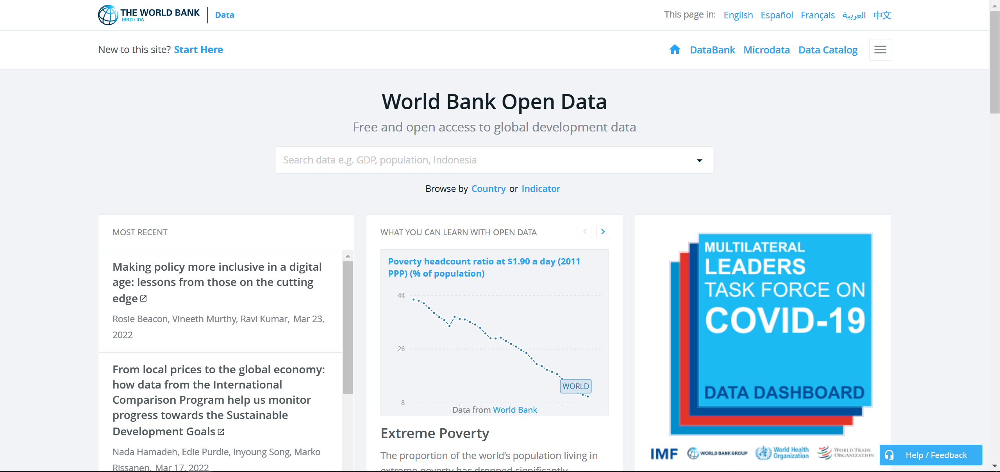

# 鲸析数据分析项目第一期


## 👉个人微信

<div align=center>

</div>


## 👉个人公众号：鲸析

<font color=red>关注鲸析，给你惊喜！</font>

<div align=center>

</div>

## 👉个人小红书：鲸鲸说数据🐋

<div align=center>

</div>

## 👉个人网站：

<div align=center>

</div>

* https://zg104.github.io


## 👉项目简介


<div align=center>

</div>

- 数据提供者：The New York Times

<div align=center>

</div>

- [数据链接🔗](https://datasetsearch.research.google.com/search?query=covid-19&docid=L2cvMTFqOWNianljMw%3D%3D)


## 👉项目fork

- 参考官方文档：https://gitee.com/help/articles/4128
- gitee fork 源作者更新后如何同步更新且不覆盖自己的代码：https://blog.csdn.net/luoyeyilin/article/details/108994031


## 👉常见问题

### 🔑什么是数据分析？

<div align=center>

</div>

- 定义：**数据分析**是一个针对数据检查、清理、转换和建模的过程。

- 目标：洞察数据以求**挖掘有效信息、得出结论并为决策提供支持**。 

- 作用：数据分析在制定更科学的决策和帮助企业更有效地运营方面发挥着重要作用。

### 🔑为什么数据分析这么重要？

> 21世纪，最重要的资产是数据。

数据是复杂的、不易理解的。数据分析就是一个深入理解、洞察、挖掘数据的手段。

可以帮助企业解决：

-  **促进企业决策流程** ：大幅度增进决策效率、改善决策品质。
-  **降低企业运营成本** ：业务数据化，数据业务化。
-  **管理监督科学化** ：透过现象看本质，全面认知企业现状和趋势。


### 🔑数据分析的流程是什么？

#### 1. 提出问题

在开展数据分析之前，要针对商业需求、业务逻辑审视当前情况，对自己提出问题。

说白了， **就是你要知道自己干嘛，问题是啥，数据分析能不能帮你解决，如果能该采取哪些手段等等** 。

#### 2. 数据获取

明确目标并梳理业务逻辑之后，我们需要寻找并获取数据。

-  **爬虫** ；要确定是否合理合法
-  **甲方爸爸** ；很多乙方外包驻场就是因为这个
-  **开源数据** ；往往做项目用的

数据的来源非常重要，好的数据源会帮助你省很多事！

下面给出一些常用的免费数据源

- 👉[ **_Kaggle_** ](https://www.kaggle.com/)



- 👉[ **_Github repo for public datasets_** ](https://github.com/awesomedata/awesome-public-datasets)



- 👉[ **_Google Dataset Search_** ](https://datasetsearch.research.google.com/)



- 👉[ **_UCI ML repo_** ](https://archive.ics.uci.edu/ml/index.php)



- 👉[ **_World bank data_** ](https://data.worldbank.org/)



#### 3. 数据清洗

```diff
+ Data cleaning is the process that removes data that does not belong in your dataset. 
```

 _Always remember that Data is not always clean like Kaggle Dataset._ 

原数据（raw data）的清洗是很多数据分析师的梦魇，因为真的 **80%** 以上的时间和精力都花在了这里。

因为我们不想 **GIGO** 。

> In computer science, garbage in, garbage out (GIGO) is the concept that flawed, or nonsense (garbage) input data produces nonsense output. Rubbish in, rubbish out (RIRO) is an alternate wording.

这其中包括：

- 重复、无关值处理
- 结构性错误处理
- 异常值处理
- 缺失值处理
- 验证&迭代

#### 4. 探索性分析（EDA）

> EDA turns almost into completely.

EDA主要做两件事：

- 更进一步处理数据
- 深入了解变量特征之间以及和目标变量的关系


<div align=center>

</div>

#### 5. 结果分析

能给不懂数据的人把你的东西讲给领导，让他懂并认可还能通过你的分析意见作出决策。

> 光说不练假把式，光练不说傻把式。

内容做好还远不够，更要能说会道，把你的东西呈现出来！

做好这关键一步： **Data Storytelling** ！精辟！


如果你对「 **数据分析** 」有很强的兴趣，有足够时间去摸索，并且对自己的技术充满信心，并且自己也能狗找到志同道合的朋友一起玩耍，那么建议自学。

不然为什么不来参与？

### 学前五问


```
你有一个沉浸式的数据分析学习氛围么？

你一个月时间自己可以完成项目么？

你看网上代码可以理解、挖掘所有知识点、易错点么？

你能学习建设自己的一套数据分析、建模体系么？

你能完整的跟面试官端到端地叙述整个项目，接住面试官所有的问题么？
```


1. **思维引导+代码拆解+视频讲解** 至少你在我这里不会因为看了我视频讲解而技术性劝退。
2. **组长督促+组内讨论+组间竞争** 志同道合的人就在身边，随时组队随时讨论交流，既认识很多朋友，又可以讨论问题。
3. **面试提升+case梳理+简历完善** 没有portfolio、website不着急么？海外求职也好、国内求职也罢，一份闭环的项目流程经历会让你超过很多peers。


### 鲸析的优势在哪？

1. **物超所值**（跟市场比一比就知道了）
2. **全链路教程**（真正的端到端做项目，不阉割任何步骤）
3. **全程追踪**（切实了解各阶段伙伴需求，不断迭代优化，内容不是一成不变）
4. **中英项目展示**（真实的presentation场景，扎心的组长challenge）
5. **背景提升**（光荣写入简历、附上github链接）

最终，欢迎大家加入【鲸析】大家庭！一起学习，一起进步！
